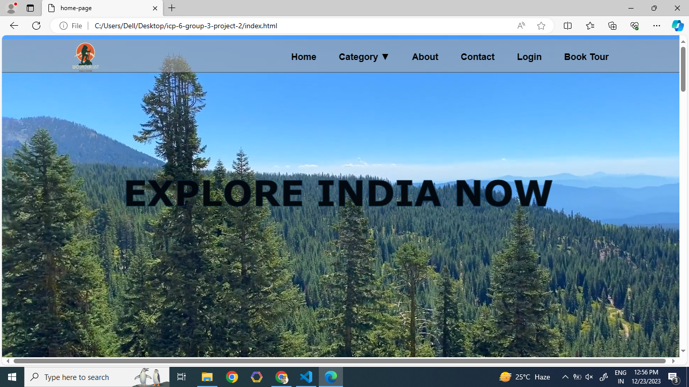

<h2>Title:<h2> 

 wounderlust is a tourist website that is designed for people to explore india .
 

<h2>Introduction:<h2>
<h4>
Using this website, we can visit every place in India. This website is very easy to use. If you want to visit a temple,  
you can book a special temple tour from here. In this website we can also find many tourist places or activity places  
like beaches, hiking, historical places, water activities etc. 
<h4>

<h2>Features:<h2>
▪User friendly  
▪Mobile friendly 
▪Logo 

<h2>Images of our website</h2> 

 

